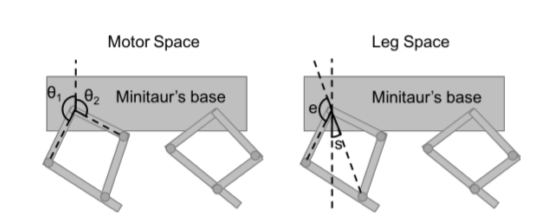
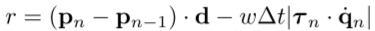
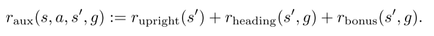

#### 待办事项
1. **设置action的区间ClipAction，swing:[-0.5, 0.5], extension:[0.5π - 0.5, 0.5π + 0.5]**
    ```python
    # wrappers.py
    import gym
    import numpy as np
    
    
    class ClipAction(object):
      """Clip out of range actions to the action space of the environment."""
    
      def __init__(self, env):
        self._env = env
    
      def __getattr__(self, name):
        return getattr(self._env, name)
    
      @property
      def action_space(self):
        shape = self._env.action_space.shape
        return gym.spaces.Box(-np.inf * np.ones(shape), np.inf * np.ones(shape), dtype=np.float32)
    
      def step(self, action):
        action_space = self._env.action_space
        action = np.clip(action, action_space.low, action_space.high)
        return self._env.step(action)
    ```


2. **多个环境同时学习BatchEnv**
    ```python
    # batch_env.py
    # chapter09.py
    ```
3. **奖励函数设计不合理**
   
   
    
    ```text
    方向和位移距离的乘积减去单位时间内电机扭矩和电机速度的乘积
   
    文章："Sim-to-Real_Learning Agile Locomotion For Quadruped Robots"
   
    在这个实验奖励函数被设计为鼓励更快的向前奔跑速度和很高的能量消耗惩罚
    ```
   **对奖励函数的进一步改进**
    - 奖励函数
   
        
    - 额外辅助内在奖励函数
    
   
    ```text
    1. 鼓励保持直立，当Z轴坐标过低时，施加惩罚
    2. 鼓励四足机器人朝着目标点前进
    3. 当四足机器人距离目标点在0.5米之内时，施加奖励
   
    文章："Multi-Agent Manipulation via Locomotion using Hierarchical Sim2Real"
    ```
    

**改进**
1. 当机器人的倾斜角过大，基座过低或者机器人摔倒就重新开始
2. 机器人训练时的开环控制信号，是否可以作为智能体的输入（确定的开环控制信号只能得到确定的策略）


**环境参数的设置**
1. 判断智能体是否摔倒的条件设置不合理（判断的倾斜角过大），导致智能体倾向于摔倒减少能量的消耗
2. 开环控制的周期信号的频率过小


    